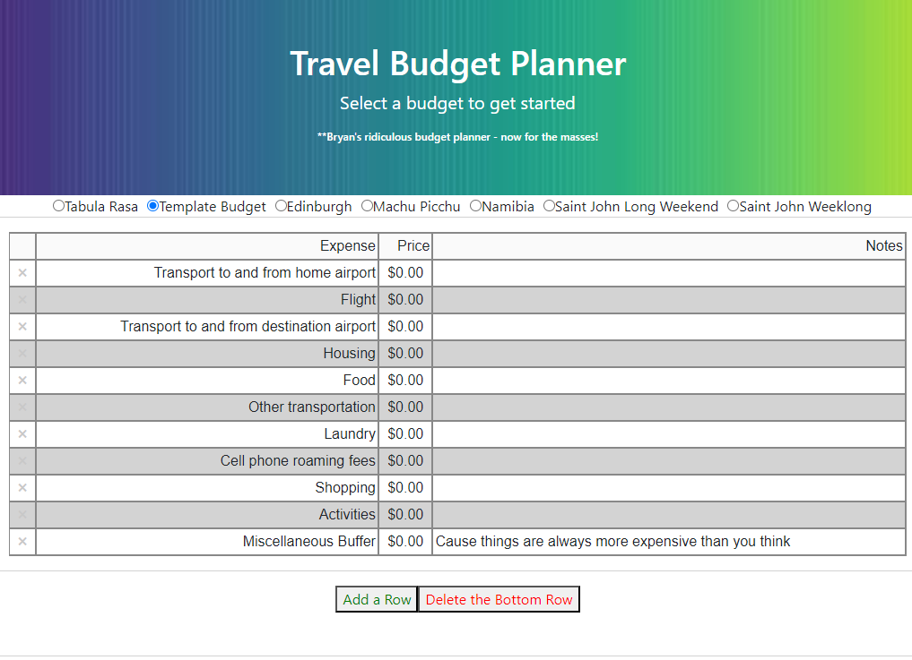
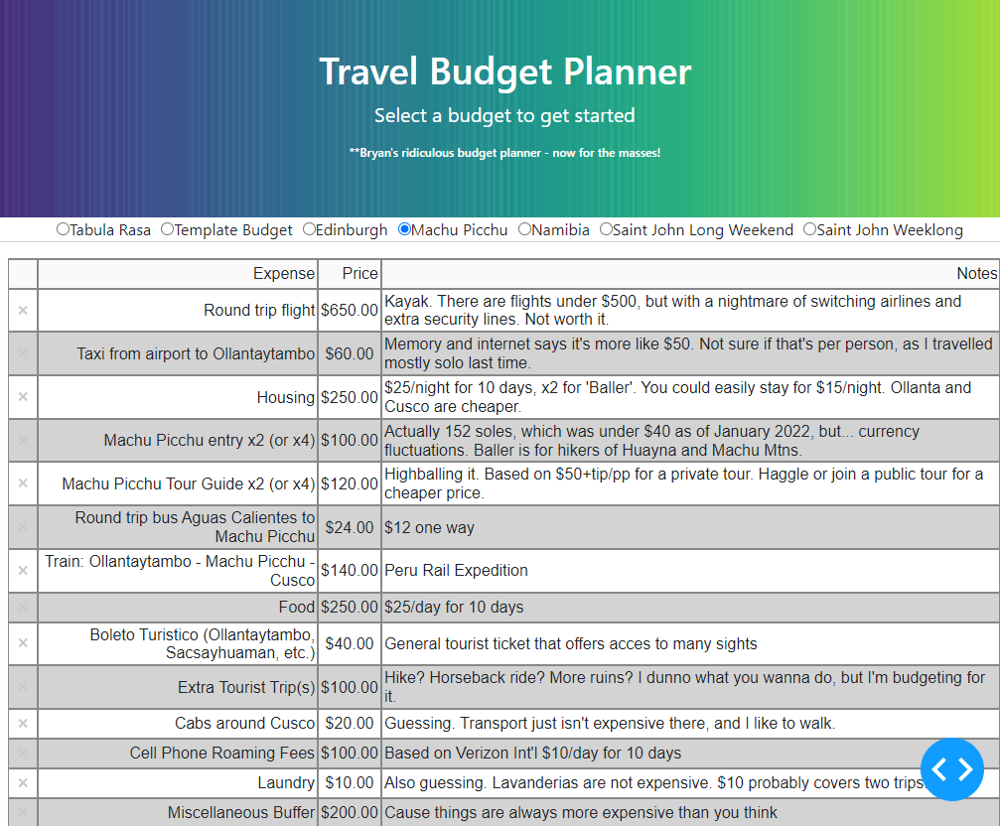

# Python Travel Budget with Dash demo

Development on this project has stopped.

## Table of Contents

- [Description](#description)
- [Usage](#usage)
- [Gallery](#gallery)
- [Rogues Gallery](#rogues-gallery)
- [References](#references)
- [Licenses](#licenses)
- [Acknowledgements](#acknowledgements)
- [Author](#author)

## Description

This project was developed as a final project for [cs50's Introduction to Programming with Python](https://cs50.harvard.edu/python/2022/weeks/0/). It provides a dashboard for building and exporting travel budgets, and includes example budgets and a donut chart for visualization.

This project evolved from a few base requirements, namely that the main program must be a python project, rather obvious, with at least three functions outside of main that had accompanying unit tests in a separate file. This obviously impacted the design.

As I've mostly focused on data science / analysis / visualization, coming up with a good, clean, command line python project stumped me for a bit. I decided I want to talk about travel stories - at least I'd enjoy the subject matter, and amuse my friends and family who've been subjected to my budget spreadsheets (and then thanked me for the awesome vacations). I replicated my spreadsheets, building a budget app that ran from the command line using tabulate and Pandas DataFrames to display info on the command line.

That lasted a hot second before I tossed the idea and went with Dash from Plotly. It was something I'd never used before - bonus points for learning something new! Programming html from python intrigued me. I could build a python project that had the user-friendliness of a webpage, much more visually appealing than tabulate boxes printing to the terminal. It also vastly increased the amount of time that I spent on this project.

I hit a lot of walls along the way on this one.

It took a bit to orient myself to programming in html with NOT html. Several times I tried to use the same Output in different callbacks, a big no-no to avoid triggering a race condition. I now know the difference between a modal (that's a thing?) and a popup. Figuring out how to save the selected radio button (hide it in a div for passing between callbacks) took some time. It took me a moment to wrap my head around the idea that a Dash state is like a session or a cookie. Something about the 'Add a Row' and 'Delete the Last Row' buttons took forever - it kept reloading the original cv, although I can't remember what now. All that on top of the usual kinks and mistakes - I'd constantly tweak something and get a 'DataFrame has no "Price" attribute error. I 'll document design choices better next time.

But Dash has far friendly documentation that Python, so it wasn't too hard to learn. Another day, another five billion errors.

But I figured it out. I started with loading the csv's and building the tables, than getting the math to work between the budget table and the grand total table. The download button was a cinch. Then adding in a modal to prevent users from accidentally changing their budget - a nod to defensive programming. And I got my logic down for automatically formatting the Price column every time with a little regex, also preventing user chicanery. And I threw in a plot at the end, just because. Coudn't get it to work for mobile, though. I shall worry about that if I Heroku it.

Ideas for the future: I would clean up the formatting a lot, add options for what type of file is exports (Excel, Google Sheets, HTML, even SQL or JSON if I wanna go crazy). Maybe change the donut chart to a bar chart. Add an option to load a file.

Honestly, I'd love to set up an auto-generated budget, using api's to places like skyscanner (for flight info). But that's a bit ambitious - where can you web scrape an estimate for the cost of meals in random places? It requires thought.

So there's my little toy, an ode to my friends and many adventures, of the global AND the computational variety. Check out some images below!

## Usage

Launch the `main.py` dash app from the command line. Peruse the radio buttons at the top to get ideas for how to assemble a travel budget. A modal will prevent a user from accidentally leaving a budget in progress. The large `Add a Row` and `Delete the Bottom Row` buttons will add or subtract a row from the bottom of the table. Sneakily, there are small x's on the right that will allow a user to delete rows from the middle of the table.

The budget will constantly update the lower table, summarizing the grand total and adjusting the donut chart.

Clicking the `Save and Download` button will convert the budget to a csv and download to the user's hard drive.

Run `pytest` from the command line to see the results of the unit tests contained in `test_main.py`.

## Gallery

Template:

Machu Picchu Budget:

Machu Picchu Summary and Plot:

Saint John Budget:

Saint John Summary and Plot:

## Rogues Gallery

## References

Sample budgets provided by author

## Licenses

[Creative Commons Attribution 4.0 International License](http://creativecommons.org/licenses/by/4.0/)

## Acknowledgements

Much gratitude to the cs50 team, for helping this autodidact learn to code.

And to the friends and family who've journeyed with me.

## Author

Bryan Johns, February 2024